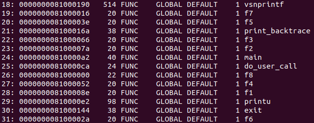
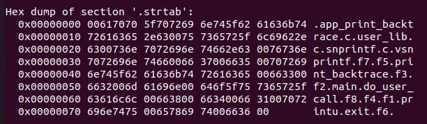

# lab1_challenge1_backtrace

**首先明确我们需要做什么，由于没有此系统调用，所以我们肯定要添加系统调用，并完善相关路径。其次在调用函数中，我们需要获取用户程序的栈，才能追溯到函数的返回地址，要注意的是，系统调用时会切换到S模式的用户内核栈，但我们需要在用户栈上寻找。最后找到返回地址后，需要将虚拟地址转换成源程序中的符号，由文档可知该内容与ELF文件的symtab section和strtab seciton有关。**


## 添加系统调用

- 首先在user_lib.h文件中添加print_backtrace()函数原型，完成函数声明

  ```
  int printu(const char *s, ...);
  int exit(int code);
  //added
  int print_backtrace(int depth);
  ```

- 然后在user_lib.c文件中完成该函数的实现，仿照printu和exit，此处转化为对do_user_call()的调用即可

  ```
   int print_backtrace(int depth) {
      return do_user_call(SYS_user_backtrace, depth, 0, 0, 0, 0, 0, 0);
    }
  ```

- 因为需要告诉do_user_call系统调用号，所以需要添加宏，找到syscall.h往里添加：

  ```
  #define SYS_user_backtrace (SYS_user_base + 2)  //与前两个不同即可
  ```

- 然后就是do_user_call中ecall指令使机器转到trap处理入口smode_trap_vecotr，再调用smode_trap_handler()函数，判断为系统调用后，转而调用handle_syscall()函数，进一步调用do_syscall()函数，其实调用过程与lab1_1_syscall一致，所以我们在do_syscall中添加sys_user_backtrace()函数到switch分支即可：

  ```
  long do_syscall(long a0, long a1, long a2, long a3, long a4, long a5, long a6, long a7) {
    switch (a0) {
      case SYS_user_print:
        return sys_user_print((const char*)a1, a2);
      case SYS_user_exit:
        return sys_user_exit(a1);
      case SYS_user_backtrace:
        return sys_user_backtrace(a1);  //a1就是depth
      default:
        panic("Unknown syscall %ld \n", a0);
    }
  ```

- 到此系统调用添加完成，接来下要完善系统调用具体内容

  

## 获取用户栈和函数返回地址

- f1到f8和print_backtrace的被调用时系统处于用户态，所以他们会在用户栈上操作。print_backtrace调用的do_user_call()会通过ecall指令使系统陷入S态，所以此时转到用户内核栈上操作。我们可以通过`riscv64-unknown-elf-objdump -d obj/app_print_backtrace`来查看该程序的汇编代码，可以发现f1到f8函数代码基本一致：

  ```
  000000008100008e <f1>:
      8100008e:	1141                	addi	sp,sp,-16
      81000090:	e406                	sd	ra,8(sp)
      81000092:	e022                	sd	s0,0(sp)
      81000094:	0800                	addi	s0,sp,16
      81000096:	fe5ff0ef          	jal	ra,8100007a <f2>
      8100009a:	60a2                	ld	ra,8(sp)
      8100009c:	6402                	ld	s0,0(sp)
      8100009e:	0141                	addi	sp,sp,16
      810000a0:	8082                	ret
  ```

- f1到f8在栈中所占都是16字节，高地8字节存ra，即该函数的返回地址，低字节存s0，指向调用该函数的函数返回地址。print_backtrace同样占16字节。特别注意用户态函数do_user_call，他开辟了32字节：

  ```
  00000000810000ca <do_user_call>:
      810000ca:	1101                	addi	sp,sp,-32
      810000cc:	ec22                	sd	s0,24(sp)
      810000ce:	1000                	addi	s0,sp,32
      810000d0:	00000073          	ecall
  ```

- 随后调用ecall进入s态

- 所以我们首先令sp+24指向第一个fp，然后循环+16即可得到之前所有函数的返回地址，**注意这个返回地址是调用该函数的指令的下一条指令的地址，而我们后面需要解析的是函数的首地址**

  ```
   uint64 user_sp = current->trapframe->regs.sp+24;
     int64 Depth=0;
    for (uint64 p = user_sp; Depth<depth; ++Depth, p += 16)
  \
  将虚拟地址转化为源符号部分
  \
  ```

  

## symtab section and strtab section 处理

- 其实就是读取两个section的内容，并理清楚两者关系。首先在linux源代码中的elf.h文件中获取symtab的符号结构，后续需要读取，所以添加到elf.h中：

  ```
  typedef struct {
     uint32 st_name;         /* Symbol name (string tbl index) */
     unsigned char st_info;  /* Symbol type and binding */ 
     unsigned char st_other; /* Symbol visibility */
     uint16 st_shndx;        /* Section index */
     uint64 st_value;        /* Symbol value */
     uint64 st_size;         /* Symbol size */
   } elf_symbol_rec;
  ```

- 由文档可知st_name可能是相对于某一个地址的偏移，我们通过相关指令观察两个section的内容：
  
  

- 其中strtab是被00分开的。我们可以通过将name按整形打印出来观察，便可发现一定规律。拿vsnprintf举例，它按整形打印的结果是45，随后我们发现在strtab中，45之后便是vsnprintf符号，即strtab[45]="vsnprintf"。所以可以理解symtab中的name是怎么作为strtab的索引的了。

- 随后我们需要读取两个section的内容，首先需要修改存储文件上下文结构体elf_ctx_t的定义，让其能存储我们我需要的信息，即strtab和symtab内容：

  ```
  typedef struct elf_ctx_t {
    void *info;
    elf_header ehdr;
  
    char strtab[999];     //存放strtab中的字符串
    elf_symbol_rec syms[999];   //保存symtab每一个symbol的内容
    uint64 syms_count;       //记录symbol的的count，方便后续遍历
  } elf_ctx;
  ```

- 再是读取内容：

  ```
  elf_status elf_load_symbol(elf_ctx *ctx) {
    elf_section_header sh;
    int i, off;
    for (int i = 0, off = ctx->ehdr.shoff; i < ctx->ehdr.shnum; 
      ++i, off += sizeof(elf_section_header)) {
      if (elf_fpread(ctx, (void *)&sh, sizeof(sh), off) != sizeof(sh)) return EL_EIO;
      if (sh.sh_type == SHT_SYMTAB) {  
        if (elf_fpread(ctx, &ctx->syms, sh.sh_size, sh.sh_offset) != sh.sh_size)
          return EL_EIO;
        ctx->syms_count = sh.sh_size / sizeof(elf_symbol_rec);  
      } else if (sh.sh_type == SHT_STRTAB) {  
        if (elf_fpread(ctx, &ctx->strtab, sh.sh_size, sh.sh_offset) != sh.sh_size)
          return EL_EIO;
  		else  break; //因为之后还有string table ，防止覆盖strtab内容
      }
    }
    return EL_OK;
  }
  
  ```

- 到此文件读取函数定义完成，因为kernel.c文件中的函数load_user_program函数中通过load_bincode_from_host函数完成文件装载，所以我们还需要将elf_load_symbol添加到load_bincode_from_host函数中：

  ```
  void load_bincode_from_host_elf(process *p) {
  ……
  if (elf_load_symbol(&elfloader) != EL_OK) panic("fail to load elf symbols.\n");    //elfloader可在文件中定义
  ……
  }
  ```

-  此时进程已完成文件装载，所以我们再回到syscall.c中来处理我们的sys_user_backtrace函数，当然前提是添加头文件`#include "elf.h"`和`extern elf_ctx elfloader;`来取用我们所需要的section。

  ```
  int backtrace_symbol(uint64 ad) {
    uint64 t = 0;
    int idx = -1;
    for (int i = 0; i < elfloader.syms_count; ++i) {
      if ((elfloader.syms[i].st_info == STT_FUNC && elfloader.syms[i].st_size != 514 && elfloader.syms[i].st_value < ad && elfloader.syms[i].st_value >t) ) {    //后续解释elfloader.syms[i].st_size != 514
  	t = elfloader.syms[i].st_value; 
        idx = i;
      }
    }
    return idx;
  }
  
  ssize_t sys_user_backtrace(int64 depth) {
      uint64 user_sp = current->trapframe->regs.sp+24;
     int64 Depth=0;
    for (uint64 p = user_sp; actual_depth<depth; Depth, p += 16) {
     if (*(uint64*)p == 0) continue;
        int symbol_idx = backtrace_symbol(*(uint64*)p);
       if (symbol_idx == -1) {
          sprint("fail to backtrace symbol %lx\n", *(uint64*)p);
          continue;
        }
        sprint("%s\n", &elfloader.strtab[elfloader.syms[symbol_idx].st_name]);
  ```

- 仅需注意symtab中的value是函数的首地址，而我们sp指向的是函数返回地址。

